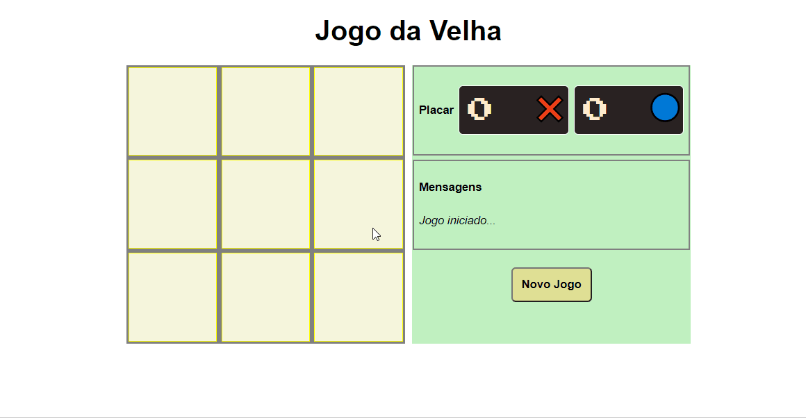

# Jogo da Velha

### :computer:	Tecnologias:
 - HTML
 - CSS
 - Javascript

 
 ### :star: Principais aprendizados:
  - Posicionamento com CSS utilizando display flex e grid
  - Manipulação do DOM e Funções Javascript
  - Operador Condicional Ternário
  
  ### :video_game: Jogue utilizando o link abaixo:
  https://fa-biano.github.io/Jogo-da-Velha/
